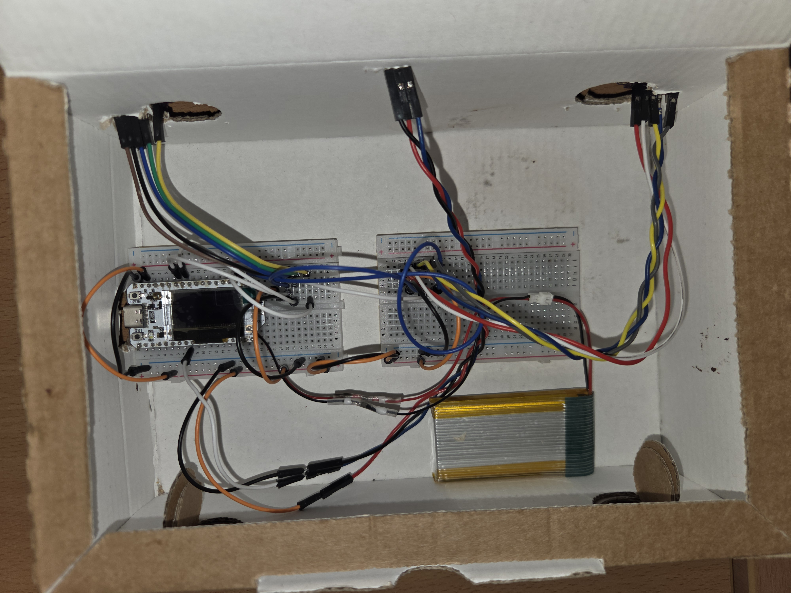

# LaserGate
IoT Algorithms and Services group project

[Matteo Mastranza](https://www.linkedin.com/in/matteo-mastranza), [Alberto D'Onofrio](https://www.linkedin.com/in/alberto-d-onofrio-67623623a
)

## Project Description

LaserGate is a system for access and occupancy monitoring for Universities and libraires. Optimized for power efficiency, it counts passing individuals and synchronizes real-time room occupancy with an AWS cloud infrastructure.

# Final Delivery

[Presentation](https://docs.google.com/presentation/d/1aCLuXgRK-9FuZfZWIBI8VZhKv6NX261EDPOm5cYrb30/edit?usp=sharing)

[Documentation Overview](https://github.com/Matteoleme/LaserGate/blob/main/docs/FinalDelivery/FinalDelivery.md)

**Video Demo:**
<video src="./docs/FinalDelivery/Video/VideoDemoPresentation.mp4" controls="controls" style="max-width: 100%;">
</video>

# Previous Presentations

## Project first presentation
[Presentation](https://docs.google.com/presentation/d/13oXGqMe2pECSd8EAlbgP-BsSp5TTP1uNVOthMb52-k8/edit?usp=sharing)

## 2nd Delivery

[Presentation](https://docs.google.com/presentation/d/1FaFsxyuVXrx55HQ5tTMlRwahedIPWIDEz-U0NudAKOQ/edit?usp=sharing)

[Documentation Overview](https://github.com/Matteoleme/LaserGate/blob/main/docs/2nd%20Delivery/2ndDelivery.md)

