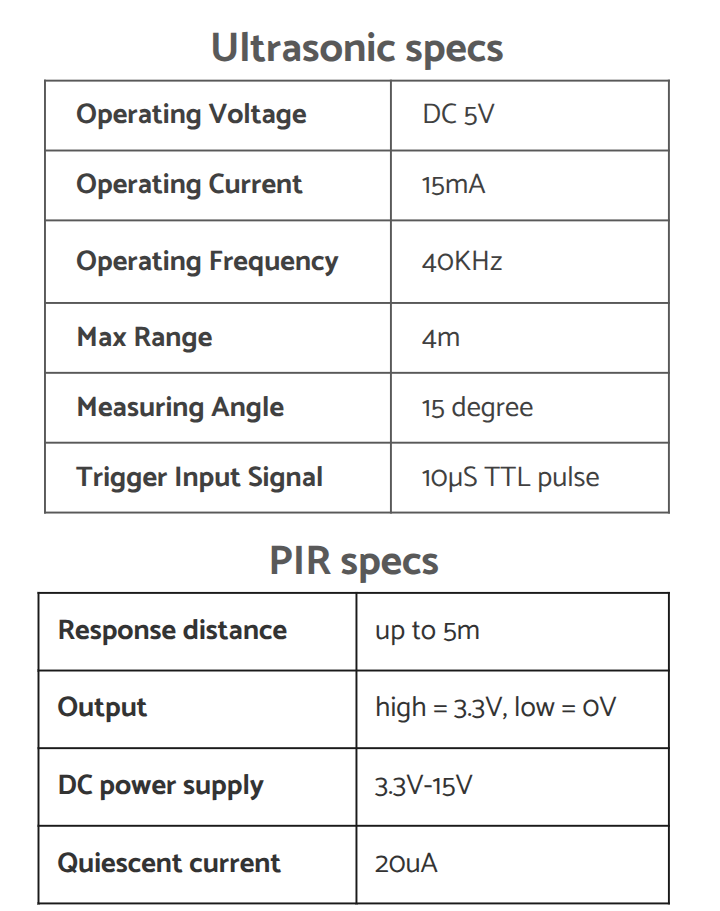
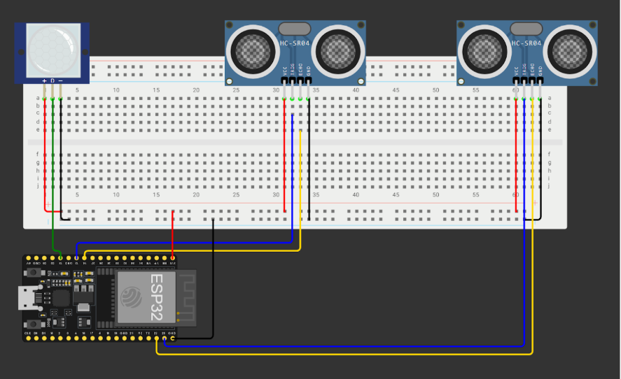
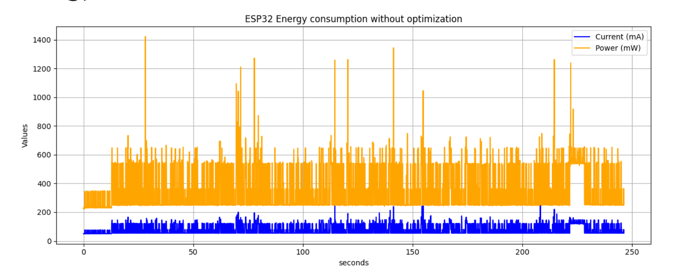
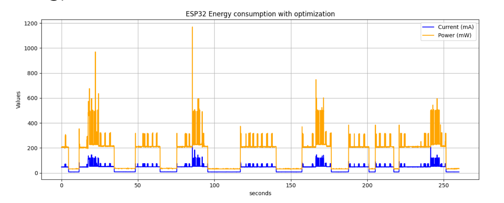

# Second Delivery

## Changes from first delivery

The idea of our project is to improve the experience of students and users of libraries and classes that have trouble tracking how many people are inside. Our system helps to prevent the overcrowding of spaces when the capacity is full and to improve the experience of students that can avoid the libraries that are already full.

In our original idea we would use two laser sensors placed at the door that would count precisely how many people are entering or exiting the room , supported by an ultrasonic sensor to evaluate the distance and support the algorithm for example in case of two people entering simultaneously. 

After that we started the first tests with laser sensors and we realized that having a laser and the receiver that triggers when the laser is interrupted by a person passing was very difficult to realize correctly on a door for a real case scenario and - the laser sensor consumed too much energy. \
So we decided to use two ultrasonic sensors to count the people in the room. We started writing the prototype code simulating the environment with a very close distance (<20 cm) of an object passing by and the first algorithm gave pretty good results. \
Then to fulfill the energy requirements we have the constraint to save energy consumption and the two possible ways to do it in our case are: optimize the times that we sent the value of the people inside the room with mqtt and optimize the consumption of our board when in use entering deep sleep when there are no people to count , saving so a lot of energy. So when trying to implement deep sleep in our first algorithm we faced a problem: the ultrasonic sensors that we are using have a trigger and echo pin that calculates the distance of the object in front considering the time that took the echo pin to receive the ultrasonic wave, but when the board is in deep sleep there is no trigger active that sends the wave so the echo can never be triggered and the board can never wake up from the deep sleep. \
To optimize the energy consumption and also compute correctly the number of people inside the room we cannot use timers to wakeup so we used a little infrared sensor that wakes up the board when someone passes in front of it. For this demo we only used one infrared sensor but for the next delivery we will consider if is needed a second sensor that checks people on the opposite direction or if we can optimize the position and the angle to use only one.

## Requirements:

- The first and most important requirement is the battery duration and so the lifetime of our board, we want to optimize as much as possible the energy consumption so that we have the longest possible operational life without need to change the batteries. We first started this process of energy consumption optimization swapping the laser sensors and photoresistors with ultrasonic sensors that consume much less power. In particular the ultrasonic sensors only consume 15 mA while the laser sensors and photoresistors consume 45 mA together. Then the second and most important optimization that we have done is to enter deep sleep when it is useless to continue monitor the gate because there is no one passing. We are still doing quantitative tests to show how much energy we are saving and this will be completed for the final delivery. \
We also implemented an adaptive algorithm to further reduce unnecessary energy consumption during data transmission. This algorithm dynamically adjusts how often data is sent via MQTT, based on how full the room is. We defined three thresholds of occupancy variation—USUAL, MEDIUM, and HIGH—that determine when the board should send an update. \
For example, under normal conditions (when the room is less than 80% full), the system sends an update only if the number of people changes by ±5. As the occupancy increases and crosses defined thresholds, the sensitivity to variation increases as well: the board will then send updates for smaller changes (e.g., ±3 or ±1), prioritizing timely alerts as the room nears maximum capacity. \
This mechanism allows us to avoid frequent and unnecessary transmissions when the room is mostly empty, while ensuring higher precision and responsiveness when it matters most.
- Another important requirement is security, we want to grant a secure connection between the esp32 board and the cloud server that will store the data about the capacity of the room. We plan to use aws iot core to save the value so that it can be used easily by Sapienza websites or apps.

## Technical Work:
Technical Work since the first delivery:

- First we started defining the main functionality of the algorithm , and ensure that the algorithm to count the number of people were working correctly.
- Then we started defining strategies to fulfill energy requirements and implemented them , first by changing sensors and then adding deep sleep.
- Then we added the MQTT functionality to send the value of the current people inside the room
- Finally we started doing evaluation on energy consumption and planning other evaluations for the next delivery.

## Components and hardware architecture: 
The main sensors used are two ultrasonic sensors HC-SR04 and a single pir SR602 with the following specifications: 

The hardware architecture is the following:

## Energy Consumption Evaluation

### Architecture
To evaluate the energy consumption of the system, we set up the following architecture:
- Device to measure: an ESP32 running the actual firmware developed for the project.

- Measurement Setup: a second ESP32 connected to an INA219 sensor module, used to monitor current and voltage, and thus calculate the energy consumption of the device.

### Use Case Analyzed
We tested a specific 5-minute (about) scenario where the ESP32 performed the following tasks:
- Woke up from deep sleep 8 times

- Sent 4 MQTT messages

- Detected approximately 20 people passing by the sensors

This scenario was intentionally designed to stress the system and measure energy usage under a relatively high-activity period. In a real-world situation, the number of wake-ups and MQTT transmissions would likely be lower within such a short time frame.

The results of the evaluation are first regarding the energy consumption without optimization followed by the energy consumption with optimization.

## Plans for Technical development and Evaluation expected for Final Delivery:

- We evaluate the use of different sensors since the functionality of the main algorithm will remain the same but maybe other types of sensors have a better performance and better results.
- We will complete the evaluation of energy consumption using a different (more performant) strategy to enter deep sleep.
- Granting a secure connection to the mqtt broker , and in our case we want to use aws iot core to save the data regarding the people in the library so that in a real use scenario it is easily retrievable for Sapienza websites or apps.