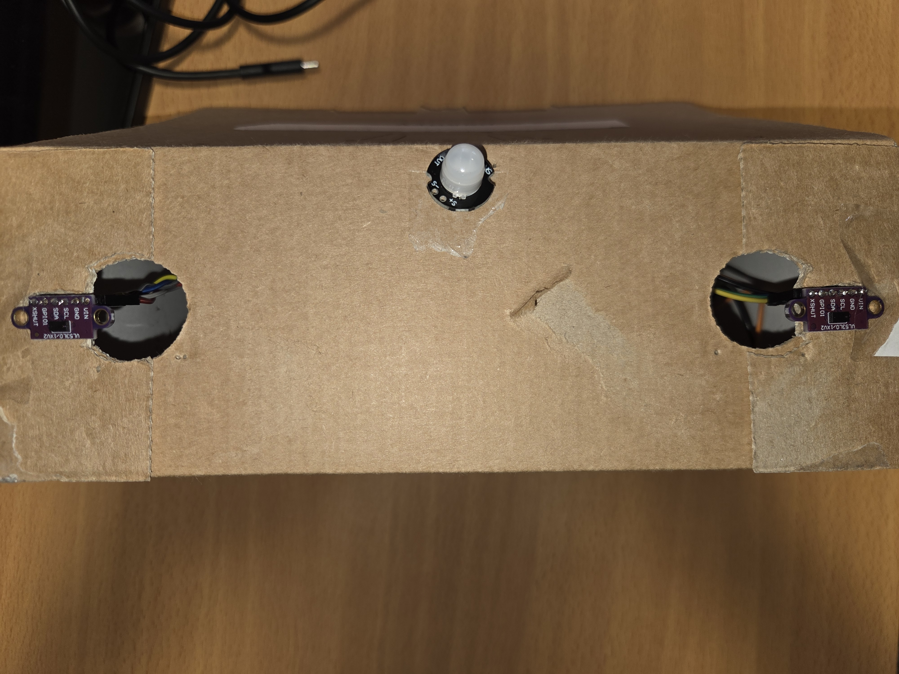
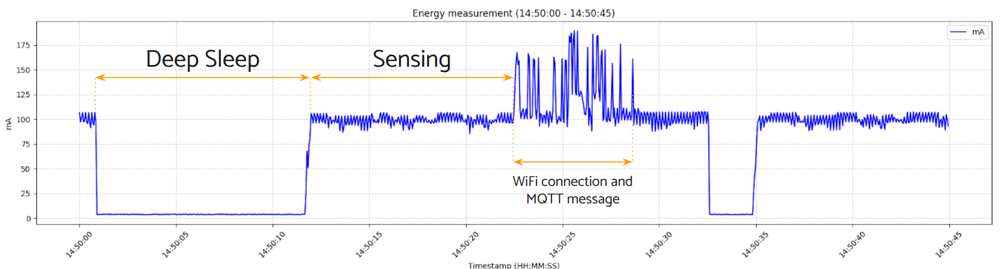
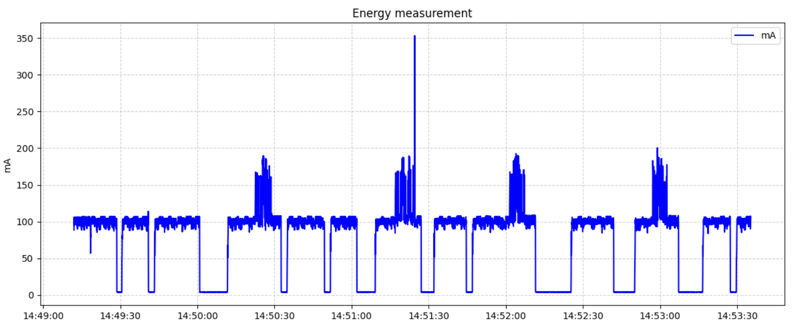

# Final Delivery

## **1\. Software Architecture and Algorithm Enhancements**

The most significant evolution between the intermediate and final delivery of this project is the transition from ultrasonic sensors to VL53L0X Time-of-Flight (ToF) sensors. While the core directional counting logic remains fundamentally similar, the software architecture and the state-machine algorithm required some modifications to accommodate the new hardware, improve accuracy, and optimize power consumption.

### **1.1. Sensor Migration and I2C Addressing Strategy**

The system has shifted from measuring sound wave return times via digital Trigger/Echo pins to calculating the time a laser photon takes to bounce back. This provides a much faster sampling rate, higher precision, and a narrower detection cone, effectively eliminating lateral false positives.

A major technical challenge with the VL53L0X sensors is that they communicate via the I2C protocol (SDA/SCL pins) and leave the factory hardcoded with the exact same I2C address (`0x29`). Connecting two sensors to the same I2C bus normally creates an address collision, making it impossible for the ESP32 to distinguish between them. To resolve this, the system dynamically reassigns the addresses at boot using the hardware `XSHUT` (shutdown) pins in the `setID()` function:

1. **Total Reset:** Both `XSHUT` pins are pulled `LOW`, physically turning off both sensors and clearing the bus.  
2. **Initialize Sensor 1:** The `XSHUT` pin for Sensor 1 is pulled `HIGH`. The ESP32 initializes it and immediately overrides its default address from `0x29` to `0x30`.  
3. **Initialize Sensor 2:** With Sensor 1 now safely listening on `0x30`, Sensor 2 is powered on (`XSHUT` pulled `HIGH`), initialized, and assigned to address `0x31`. This strategy allows the ESP32 to communicate with both sensors independently on a single I2C bus.

### **1.2. State-Machine Algorithm Improvements**

To maximize the capabilities of the fast-responding ToF sensors, the counting algorithm within the FreeRTOS task was refined. First, the polling delay was drastically reduced from **100ms to 15ms**, granting the system a much higher resolution to detect fast-moving subjects. Consequently, the `DETECTION_DISTANCE` was increased to 800mm (configurable based on door width), and the debounce timer was increased to 250ms to better fit the new sensor readings.

The most critical algorithmic upgrade occurs in the `DETECTED_SECOND` state (the final phase of a passage). The logic was improved to introduce a **Dynamic Clearance Check** and a **Failsafe Timeout**:

* **Active Waiting:** Instead of blindly resetting the system after a count, the algorithm actively monitors the sensors (`if (sensor1Triggered || sensor2Triggered)`). If a subject is still lingering in the doorway blocking the beams, the system suspends the reset sequence, effectively waiting for the passage to clear.  
* **Cool-down Timer:** Once the sensors report a clear area, the system waits for an additional safety margin defined by `PASSED_TIME_AFTER_MEASURE`. This cool-down period prevents double-counting caused by trailing objects (e.g., backpacks or swinging arms).  
* **Failsafe Timeout:** To prevent the state-machine from deadlocking if an object permanently blocks the sensor (or if a person stops indefinitely), a strict 5000ms hard timeout was implemented. If this threshold is reached, the system forces a reset to the `IDLE` state.

### **1.3. Deep Sleep and Power Management Optimization**

To strictly adhere to the low-power requirements of a battery-operated device, the final code integrates the `XSHUT` pins into the power management strategy. Before the ESP32 enters Deep Sleep mode due to inactivity, the `XSHUT` pins are pulled `LOW`. This physically cuts the power to the internal laser emitters of the VL53L0X sensors, reducing their current draw to a few microamps and significantly extending the battery life?.

### **1.4. Cloud Infrastructure Shift**

Finally, the data transmission infrastructure was upgraded. The system transitioned from utilizing a local Mosquitto MQTT broker hosted on a personal computer to **AWS IoT Core**. This shift provides a highly secure, cloud-based MQTT broker, ensuring enterprise-grade encryption (TLS), better scalability, and continuous remote availability for the telemetry data compared to the local network limitations of the previous delivery.

## 2\. Requirements

### **1\. Functional Requirements**

* **Directional Counting:** The system shall accurately increment the count when a subject enters (Sequence: Sensor 1 → Sensor 2\) and decrement when a subject exits (Sequence: Sensor 2 → Sensor 1\) from the room.  
* **Occupancy Monitoring:** The system shall maintain a real-time variable of the current number of people inside the room, bounded by a defined **Maximum Capacity** (e.g., 40 people).  
* **Data Transmission:** The system shall transmit data (Total Count, Entries, Exits, Occupancy Percentage) to an MQTT Broker via Wi-Fi upon surpassing a defined threshold.  
* **Deep Sleep Management:** To conserve battery, the system shall enter **Deep Sleep mode** after a defined period of inactivity (e.g., 10 seconds), waking up only upon detecting motion via the PIR sensor.

### **2\. Operational Constraints & Algorithm Limitations**

* **Single-File Traffic:** The algorithm is designed for single-file passage. The system does not support the detection of two or more people passing through the sensor field simultaneously (side-by-side).  
* **Walking Speed Limits:** The detection algorithm is tuned for standard walking speeds.  
  * **Minimum Speed:** Subjects moving extremely slowly or stopping ("loitering") between sensors for longer than the defined CROSSING\_TIMEOUT (e.g., 1.5s) may trigger a timeout reset, resulting in a missed count.  
  * **Maximum Speed:** Subjects running or moving faster than the sensor's sampling rate (approx. \< 250ms crossing time , because 250 ms is the value of the debounce time) may not be detected correctly.  
* **Stationary Subjects:** If a subject stops directly in front of the sensors for an extended period, the system may generate unpredictable errors or force a reset to the IDLE state to prevent system hang.  
* **Ambient Light Sensitivity:** The VL53L0X ToF sensors rely on infrared (IR) lasers to measure distance. Consequently, they are highly susceptible to interference from direct sunlight or intense ambient light sources, which emit high levels of IR radiation. To prevent false positive triggers and maintain the system's accuracy, the sensors must be installed in areas shielded from direct sunlight exposure.

### **3\. Installation & Hardware Requirements**

* **Effective Range:** The ToF sensors (VL53L0X) are configured with a maximum reliable detection threshold of **800 mm (80 cm)**.  
* **Passage Width:** Consequently, the physical width of the doorway/passage must not exceed **80 cm**. If the passage is wider, subjects walking on the far side may not be detected.  
* **Sensor Alignment:** The two sensors must be mounted horizontally, spaced approximately 12 **cm** apart, at a height that captures the torso of an average adult or the lower part of the stomach.  
  The PIR sensor must be positioned as far away as possible from the entrance to capture correctly both the entering and exiting people , it is sufficient to keep it below the ToF sensors , and in a higher position.

### **4\. Power & Efficiency Requirements**

* **Power Source:** The device shall be powered by a 3.7V LiPo battery (e.g., 3000mAh).  
* **Power Consumption:** The system requires very low power consumption when there is no person entering or exiting the room , we used Deep Sleep to turn off all unnecessary peripherals leaving only the PIR sensor as a wake up source.

## 3. Accuracy

### **3.1. Testing Methodology**

To validate the reliability and accuracy of the LaserGate algorithm, a controlled physical test was conducted. The test involved multiple subjects entering and exiting the monitored area respecting all the requirements, so the subjects moved at a standard velocity and there were no side by side entrances.

To establish a reliable "ground truth," the entire session was recorded on video. The video footage was manually reviewed frame-by-frame to count the exact number of true entries and exits. The experimental data collected by the two ESP32 via the serial monitor was then compared against this ground truth.

Furthermore, a comparative analysis was performed to evaluate the performance of the current Time-of-Flight (ToF \- VL53L0X) sensor setup against the previously utilized Ultrasonic (HC-SR04) sensor setup.

[Video Accuracy](https://drive.google.com/file/d/1OxKuw1uQVhibIJR9fOL3KLVE16Zz9t0i/view?usp=sharing)

### **3.2\. Experimental Results**

The following table summarizes the data extracted from the video analysis (Ground Truth) and the data registered by the two different sensor technologies.

| Metric | Ground Truth (Video) | ToF Sensors (Current) | Ultrasonic Sensors (Previous) |
| :---- | :---- | :---- | :---- |
| **Total Entries** | 25 | 24 | 11 |
| **Total Exits** | 9 | 7 | 6 |
| **Current Occupancy** | **16** | **17** | **8** *(Note 1\)* |

*(Note 1: The ultrasonic setup registered 11 entries and 6 exits that should result in an occupancy of 5, the system counter registered 8\. This is because as can be seen in the terminal, at the beginning it registered three exits instead of entries and so the counter was still at 0).*

### **3.3\. Accuracy Analysis**

To quantify the performance upgrade, the accuracy percentage for each metric was calculated using the formula:

$$
\text{Accuracy} = \left( 1 - \frac{|\text{True Value} - \text{Measured Value}|}{\text{True Value}} \right) \times 100
$$

**ToF Sensor Accuracy:**

* **Entry Accuracy:** 96.0% (Error margin: \-1)  
* **Exit Accuracy:** 77.8% (Error margin: \-2)  
* **Overall Occupancy Accuracy:** 93.75% (Error margin: \+1)

**Ultrasonic Sensor Accuracy:**

* **Entry Accuracy:** 44.0% (Error margin: \-14)  
* **Exit Accuracy:** 66.7% (Error margin: \-3)  
* **Overall Occupancy Accuracy:** 50.0% (Error margin: \-8)

### **3.4\. Discussion and Technical Conclusions**

The data clearly demonstrates a massive leap in reliability when transitioning from ultrasonic to Time-of-Flight technology. The overall occupancy accuracy improved from an unacceptable 50.0% to a highly reliable 93.75%.

The discrepancies in performance can be attributed to the fundamental physics of the sensors used:

* **Beam Angle and Cross-Talk:** Ultrasonic sensors emit sound waves in a wide conical shape (typically 15° to 30°). When two ultrasonic sensors are placed close together for directional counting, their sound waves overlap, causing severe "cross-talk" (one sensor reads the echo of the other). We tried as we showed in the previous presentation that we can reduce this cross-talk, putting them in favorable angles but for this test we wanted to replicate as much as possible a real scenario, when it’s impossible to setup differently and very faithfully every system for a different room, but the system should work well even with minimal setup. The ToF VL53L0X, conversely, uses a highly focused infrared laser (VCSEL) with a very narrow Field of View (FoV), completely eliminating cross-talk and allowing for precise adjacent placement.  
* **Echoes vs. Light:** Ultrasonic sound waves easily bounce off irregular surfaces (baggy clothing, backpacks), creating "ghost echoes" that trigger false positives (as seen in the erratic counter behavior of the old setup). ToF sensors measure the time it takes for photons to bounce back, providing a much cleaner and more stable distance reading regardless of the target's acoustic reflectivity.  
* **Response Time:** The ToF sensors operate at the speed of light with a fast sampling rate, allowing the state-machine algorithm to rapidly detect the transitions. Ultrasonic sensors rely on the speed of sound, which introduces a mechanical delay, often missing subjects walking at faster-than-average speeds.  
* **Minor ToF Discrepancies:** While the ToF setup is vastly superior, it recorded a minor error (missing 1 entry and 2 exits). As defined in the project constraints, these isolated errors are likely due to subjects swinging arms triggering premature state resets or maybe little changes in direct light of the sun, which we observed is the only real interference that this type of sensors can have.

## 4. Energy Consumption Evaluation

### 4.1 Architecture
To evaluate the energy consumption of the updated system, we utilize the same architecture used in the previous delivery. This allows us to make a direct comparison between the ultrasonic sensors and the new Time-of-Flight (ToF) sensors.

### 4.2 Power State Analysis
Although we were unable to replicate the exact scenario from the previous test, we conducted a similar simulation and analyzed the device's energy consumption across three key operating states.

The measured average current consumption for each state is as follows:

| Operating State | Description | Average Current Consumption |
| --- | --- | --- |
| **Deep Sleep** | The device is in low-power mode, waiting for PIR detection. | **~3 mA** |
| **Active (Sensing)** | The device is awake, powering the sensors, and processing data (no Wi-Fi connection). | **~100 mA** |
| **Active (Transmission)** | The device activates the Wi-Fi radio to connect and publishes an MQTT message. | **~120 mA** |

The transmission state lasts for approximately 7 seconds.

### 4.3 Comparative Results
Comparing these results with the previous ultrasonic sensor architecture:

1. **Comparison:** The energy consumption remains comparable to the previous setup. The **Active (Sensing)** state consumption (~100 mA) indicates that ToF sensors do not introduce a significant power difference compared to the ultrasonic ones.
2. **Hardware Considerations:** These measurements were taken with **VIN (5V)** input. Therefore, the values also include the voltage regulator consumption. This choice was necessary because, during the high-current peaks of Wi-Fi transmission, supplying 3.3V was insufficient to maintain system stability.

## **5\. Battery Life Estimation**
Now we’re going to estimate the battery life of our system. The calculations are based on a 3000 mAh battery and a specific scenario that simulates a typical academic day.
### **5.1\. The "Lecture Cycle" Scenario**
We assume that each cycle is triggered by the start of a lecture and is composed of two main phases.
* **Peak Activity (Lecture Start):** During the first 5 minutes, as students enter the lecture room and devices connect, the system handles a "worst-case" stress load.  
  * Average Current: $75 \\text{ mA}$  
  * Energy Consumed: $75 \\text{ mA} \\times (\\frac{5}{60} \\text{ h}) \= \\mathbf{6.25 \\text{ mAh}}$  

* **Standby Activity (During Lecture):** For the remaining 90 minutes of the session, the device remains primarily in Deep Sleep.  
  * Average Current: $3 \\text{ mA}$  
  * Energy Consumed: $3 \\text{ mA} \\times 1.5 \\text{ h} \= \\mathbf{4.5 \\text{ mAh}}$
**Total for one full cycle lesson (95 minutes):** $\\mathbf{10.75 \\text{ mAh}}$

---

### **5.2\. Daily Energy Consumption**
We identify two different situations:
#### **Daytime Operations (08:00 – 20:00)**
During this 12-hour window, the device follows the lecture cycles described above (alternating between peak and deep sleep).
* Average hourly consumption: $\approx 6.79 \text{ mA}$  
* 12-hour daytime total: $6.79 \text{ mA} \times 12 \text{ h} = \mathbf{81.48 \text{ mAh}}$
#### **Nighttime / Off-Hours (20:00 – 08:00)**
Once the university closes, the device enters a continuous Deep Sleep state for 12 hours.
* Energy consumption: $3 \\text{ mA}$  
* 12-hour nighttime total: $3 \\text{ mA} \\times 12 \\text{ h} \= \\mathbf{36 \\text{ mAh}}$
---

### **5.3\. Final Estimation**
To determine the total autonomy, we aggregate the daily totals against the 3000mAh battery capacity.
| Parameter | Calculation | Result |
| ---- | ---- | ---- |
| **Total Daily Consumption** | $81.48 \\text{ mAh} \+ 36 \\text{ mAh}$ | 117.48 mAh/day |
| **Estimated Runtime** | $3000 / 117.48$ | \~25.5 Days |
#### **Summary**
Under this university-based scenario, we estimate that battery life is approximately **25 days**.

## 6. Cloud Infrastructure & Security
To improve security of the system, we migrated the MQTT communication infrastructure from a local server to **AWS IoT Core**.

### 6.1. AWS IoT Core Configuration
To enable secure communication between the ESP32 and the cloud, AWS was configured following this procedure:
* **Thing Registration**: a logical representation of the ESP32 hardware in the cloud environment.  
* **Generate Certificates:** to establish an encrypted channel, the following certificates were generated:
  * *Device Certificate:* identifies the ESP32.  
  * *Private Key:* stored securely on the device to sign requests and prove identity.  
  * *Root CA (Amazon Root Certificate):* used by the ESP32 to verify the authenticity of the AWS server.  
* **Create a Policy:** a policy document was defined to specify the ESP32's permissions. The policy grants the specific MQTT permissions required for the application:  
  * `iot:Connect`: allows the device to establish a connection.  
  * `iot:Publish`, `iot:Receive`, `iot:Subscribe`: authorized specifically for the topic path **`esp32/tof`**.  
* *This policy is attached to the Device Certificate, which in turn is attached to the Thing.*  
* **Create Endpoint:** this domain acts as the MQTT Broker address to which the ESP32 sends data.

### 6.2. Firmware Implementation (ESP32)
On the device, we updated the firmware to handle secure networking:
* **Library:** `WiFiClientSecure` library is utilized to manage encrypted (TLS) communication.  
* **Certificates:** Certificate, Private Key, and Root C are included directly into the code.
### 6.3. Data Storage and Routing
To store the data received from the ESP32 persistently, we used **Amazon DynamoDB**. The setup consists of three main components: the Database, the IoT Rule, and the IAM Role.
#### Database Configuration
DynamoDB, a NoSQL database service, was chosen for its flexibility and "schema-less" structure.
* **Table Structure:**  
  * **Primary Key (Partition Key):** `timestamp`
  * **Attributes:** the database automatically stores the rest of the JSON payload: `count`, `percentage`, `entries`, and `exits`.
#### Data Routing (IoT Rule)
An **AWS IoT Rule** is created to forward data from the MQTT topic to the database. This rule acts as a bridge that listens for incoming messages.
* **Rule Logic:** the rule is configured with an SQL-like statement to filter messages: `SELECT * FROM 'esp32/tof'`
* **Action:** when a message arrives on this topic, the rule automatically triggers an action to insert the message into the DynamoDB table.
#### Security and Permissions (IAM Role)
For security reasons, the IoT Rule does not have permission to read and write to the database by default. So an **IAM Role** (Identity and Access Management) is necessary to authorize this action.
* **Policy:** a specific policy is assigned to this role to allow the IoT Rule to write data to the Database securely, while blocking unauthorized access.

### **6.4. Web Monitoring Interface**
To display the collected data, we developed a web interface based on a **serverless architecture**.
#### **Backend Infrastructure**
The data retrieval process is handled by two main components:
* **AWS Lambda**: a function written in **Python** that scans the DynamoDB table to find and retrieve the most recent record sent by the ESP32.  
* **Amazon API Gateway**: this service provides a **public endpoint** (URL) that triggers the Lambda function. Once triggered, it returns the data to the web page in a standard JSON format.
#### **Data Update Logic**
The web dashboard is created only for **demonstration purposes** and is not the main focus of the project, so we chose a simplified update method: instead of a real-time stream, the data is updated manually via a **refresh button**. When the user clicks the button, the script performs an HTTP GET request to the API Gateway to fetch the latest values.

## 7. Conclusion

The LaserGate project successfully demonstrates the design and implementation of a highly accurate, people-counting thing device. By identifying the physical limitations of ultrasonic sensors and migrating to photonics-based Time-of-Flight (VL53L0X) technology, the system achieved a remarkable leap in occupancy tracking accuracy, rising from 50.0% to 93.75%. 

Furthermore, the project evolved from a simple tethered prototype into a robust, battery-operated standalone system. The implementation of a FreeRTOS-based architecture allowed for efficient multitasking, while we used deep sleep of the esp32 board to fit the low-power constraints. Finally, the transition to AWS IoT Core elevated the system's data telemetry, providing a secure, encrypted (TLS), and highly scalable cloud infrastructure suitable for real-world enterprise deployments.

